<div align="center">

<h1><picture><source media="(prefers-color-scheme: dark)" srcset=".github/assets/icons/mark-dark.png"></picture> PVE VM Studio</h1>

<p><b>Design VMs in the browser. Bake gold images and deploy them on Proxmox VE.</b></p>

<p>


</p>

</div>

> [!WARNING]
> **Built for labs, not for production.** PVE VM Studio creates, configures and removes VMs,
> templates, ISOs and pools on your cluster through the PVE API. Run it on a lab or test
> cluster you can afford to rebuild. Read what a feature does before you switch it on, and keep
> backups of anything you care about. The software comes as is, without warranty (see
> [LICENSE](LICENSE)); you are responsible for what it does on your systems.

## <picture><source media="(prefers-color-scheme: dark)" srcset=".github/assets/icons/vm-dark.png"></picture> What it is

PVE VM Studio is the [Hyper-V VM Studio](https://github.com/Barg0/HyperV-VM-Studio) brought to
Proxmox VE, with a server behind it. You design the VMs of a lab in the browser — names,
sizes, disks, networks, domain join, Windows roles. The studio bakes the gold images they start
from and deploys them onto the cluster. Everyone who signs in sees the same design.

- **One Rust binary in its own LXC** — web UI, REST API and job runner. Nothing to install on
  your nodes.
- **PVE API only.** No SSH to the nodes, no `qm` scripts, no hacks in the PVE UI. The studio
  works through an API token with a limited set of roles.
- **Sign in with your PVE account.** Your own PVE permissions still apply.

What it does for you:

| | |
|---|---|
| <picture><source media="(prefers-color-scheme: dark)" srcset=".github/assets/icons/gold-image-dark.png"></picture> **Linux golds** | Ubuntu 26.04 / 24.04, Debian 13 / 12, Fedora 44 / 43, Rocky Linux, AlmaLinux and Oracle Linux 10 / 9, openSUSE Leap 16, Arch — from the distribution's own cloud image, checksum checked, updated, with your region, packages and shell niceties baked in |
| <picture><source media="(prefers-color-scheme: dark)" srcset=".github/assets/icons/iso-media-dark.png"></picture> **Windows golds** | Server 2016–2025 and Windows 11 from an ISO, generalized, with virtio drivers and the QEMU guest agent. Build the ISO itself from Microsoft's update servers, already patched |
| <picture><source media="(prefers-color-scheme: dark)" srcset=".github/assets/icons/deploy-dark.png"></picture> **Deploy** | Linked or full clones, static IPs or DHCP, extra NICs and data disks, a TPM, Windows roles and features, domain join and Azure Arc onboarding — all at first boot, hands off |
| <picture><source media="(prefers-color-scheme: dark)" srcset=".github/assets/icons/update-dark.png"></picture> **Keep it current** | Windows golds can follow every Patch Tuesday on their own, in maintenance windows you set. The studio updates itself the same way |
| <picture><source media="(prefers-color-scheme: dark)" srcset=".github/assets/icons/users-dark.png"></picture> **Tell you about it** | Mail through your smart host when something fails, a VM is ready or a certificate renews |
| <picture><source media="(prefers-color-scheme: dark)" srcset=".github/assets/icons/cis-rules-dark.png"></picture> **Harden it** | CIS Level 1 / Level 2 for the Linux golds — **experimental**, see *CIS hardening* below |

<p>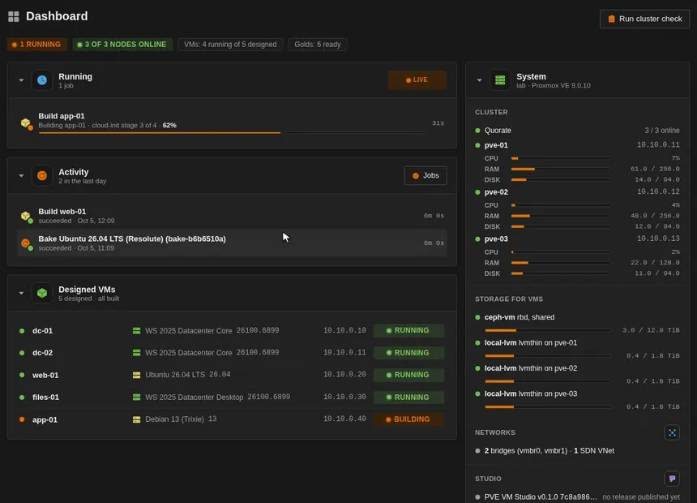</p>

## <picture><source media="(prefers-color-scheme: dark)" srcset=".github/assets/icons/validate-dark.png"></picture> Before you start

| You need | Notes |
|---|---|
| Proxmox VE 9 | A single node or a cluster. Tested on 9; PVE 8.4 has the same API but has not been tested |
| Root on one node | For the installer, once. After that you only use the browser |
| A storage for VM disks | Content **Disk image** (`images`) — LVM-thin, ZFS, Ceph, a directory. Shared storage lets one gold serve every node |
| A storage for imports | Content **Import** (`import`) — PVE downloads the cloud images there. `local` works |
| A storage for ISOs | Content **ISO image** (`iso`) — WinPE, virtio-win, Windows media |
| A bridge with internet access | Linux bakes install packages; DHCP on it, or a few static addresses for the bakes (set in the studio) |
| A Windows ISO | Only for Windows golds — or let the studio build one from Microsoft's update servers |
| A DNS name for the studio | Optional, but needed for a Let's Encrypt certificate |

Enable the content types under **Datacenter → Storage → Edit → Content** if a storage lacks one.

## <picture><source media="(prefers-color-scheme: dark)" srcset=".github/assets/icons/download-dark.png"></picture> Install

> [!NOTE]
> **There is no release yet.** Until the first one, the studio comes from the development
> build: the newest commit on `main`, built by CI as the `development` pre-release. After the install,
> set **Studio settings → Version → Channel** to **Development** — that is the channel that gets
> updates for now. Stable stays empty until a release is out.

On any node of the cluster, as root:

```sh
mkdir -p /root/pve-vm-studio && cd /root/pve-vm-studio
base=https://github.com/Barg0/pve-vm-studio/releases/download/development
for f in install.sh pve-vm-studio.service pvs-update.sh pve-vm-studio-update.path pve-vm-studio-update.service; do
  curl -fsSLO "$base/$f"
done
bash install.sh
```

The installer asks a few questions — container ID, DNS name, storage, network (DHCP or a
static address), size — with arrow keys and Enter. `bash install.sh --defaults` takes the
defaults without asking. It downloads the studio itself: the newest release, or the
development build while there is none.

What it does:

1. Creates a service account `pve-vm-studio@pve` and an API token with `PVEVMAdmin`,
   `PVEDatastoreAdmin`, `PVESDNUser`, `PVEAuditor` and `PVEPoolAdmin` on `/pool` — no
   Administrator. Two small extra roles: `Sys.AccessNetwork` on `/nodes` (so PVE may download
   cloud images) and `Sys.Modify` on `/` without propagation (for the tag colours).
2. Creates an unprivileged Debian 13 container that starts with the node, plus a separate work
   volume for bakes and media builds.
3. Installs the studio as a service on port 443, with a self-signed certificate to begin with.
4. Puts a link to the studio into **Datacenter → Notes**.

Then open `https://<the container's address or DNS name>` and sign in with your PVE account
(`root@pam` works, any other PVE user too).

The full install log is in `/var/log/pve-vm-studio-install.log`.

### <picture><source media="(prefers-color-scheme: dark)" srcset=".github/assets/icons/certificate-dark.png"></picture> First things in the studio

Open **Studio settings**:

1. **DNS name** — the name people type to reach the studio.
2. **Certificate** — get one from Let's Encrypt (HTTP-01, or DNS-01 through more than 100 DNS
   providers), import your own, or keep the self-signed one.
3. **Maintenance windows** — when the studio may update itself and your Windows golds.
   Default: every night 01:00–06:00.
4. **Mail** — optional: a smart host to send notifications through.

<p>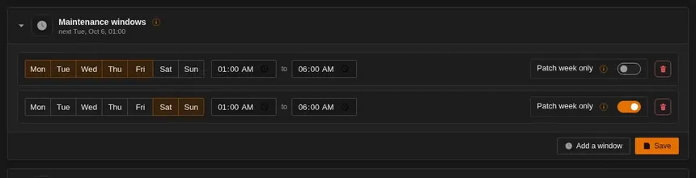</p>

## <picture><source media="(prefers-color-scheme: dark)" srcset=".github/assets/icons/gold-image-dark.png"></picture> Golds

A gold is a PVE template that every VM of its kind starts from. Golds are never changed in place:
a rebake makes a new one, and VMs keep the gold they were built from.

### <picture><source media="(prefers-color-scheme: dark)" srcset=".github/assets/icons/nic-dark.png"></picture> Where bakes run

**Media → Where bakes run** sets the node, the storages, the bridge and the size of the bake VMs.
"Auto" picks sensible ones (shared storage first). On a network without DHCP, enter one address
or a range for the Linux bakes (`10.10.0.60-69/24`), plus gateway and DNS — each bake takes a
free one, so a range lets several bakes run side by side. Windows bakes stay offline.

<p>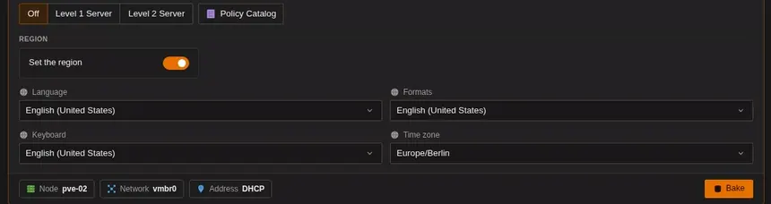</p>

### <picture><source media="(prefers-color-scheme: dark)" srcset=".github/assets/icons/servers-dark.png"></picture> A Linux gold

**Golds → Bake a gold → Linux**:

1. Pick the image.
2. Pick a package mirror (Ubuntu and Debian), the disk size and what to bake in: updates, shell
   aliases, a coloured prompt, fastfetch at login.
3. Set the region — language, formats, keyboard, time zone.
4. Optionally move this one bake to another node or network with the chips at the bottom.
5. **Bake**.

PVE downloads the cloud image and checks its checksum, the studio boots it once with a
cloud-init seed, installs everything, seals the image and turns it into a template. A few
minutes, mostly package downloads. The job log shows every step.

<p>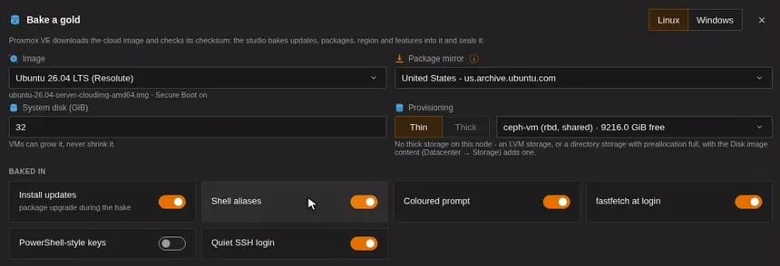</p>

<p>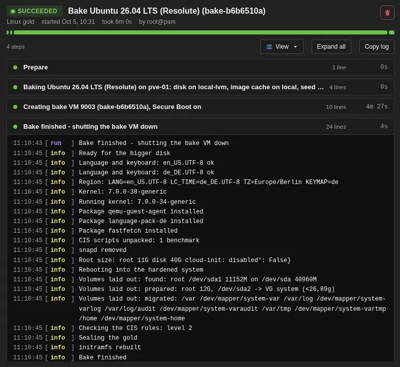</p>

### <picture><source media="(prefers-color-scheme: dark)" srcset=".github/assets/icons/os-server-desktop-dark.png"></picture> A Windows gold

Windows bakes boot a WinPE to apply the image, so that comes first.

**What WinPE is, and why the studio needs it.** WinPE (the Windows Preinstallation
Environment) is the small Windows that Windows Setup itself runs on: it boots from an ISO,
lives in memory, and has DISM, diskpart and bcdboot. Windows images can only be built and
changed properly with those Windows tools, and the studio runs on Linux. So whenever a Windows
disk has to be worked on offline, the studio boots the VM — or a short-lived worker VM — from
its WinPE ISO, hands it the job on a small seed disk and reads its progress from the serial
console:

- **Bakes** — partition the disk, apply the edition from the ISO, add the virtio storage
  driver, write the boot files.
- **Deploys** — the offline pass before first boot: roles and features, Features on Demand,
  the VM's answer file.
- **Windows media builds** — the worker that applies the cumulative update with DISM.

You build it once and the studio keeps it on your ISO storage. It carries the
virtio-win storage driver, so it sees the VM's disk. Built from Microsoft, it comes from the
newest Windows Server vNext (Insider) build — recommended: those ship at their full build, so
WinPE always has the newest DISM — or from Windows Server 2025, whose WinPE stays at the
release build. With **Keep WinPE current** on, the studio builds it again when a newer build
or virtio-win release appears.

To get going:

1. **Media → Windows: WinPE** — build it straight from Microsoft (Server vNext or 2025, en-US), or
   distil it from a Windows ISO you have in PVE.
2. **Media → Windows: virtio-win** — the driver release that goes into the golds. `stable`
   follows the virtio-win project; the studio fetches it on the first bake.
3. **A Windows ISO** — upload one to an ISO storage in PVE, or build one under
   **Windows media**: pick a product, a build and the editions, and the studio downloads the
   files from Microsoft's update servers (through the UUP dump catalog), applies the latest
   cumulative update with a short-lived worker VM and uploads a patched ISO.
4. **Golds → Bake a gold → Windows** — pick the ISO and the edition, region, policies (RDP,
   ping, Server Manager at logon …) and the disk. **Bake**.

The bake partitions and applies the image in WinPE, installs virtio and the guest agent in audit
mode, generalizes with sysprep, then sets the region and the KMS client key offline. It needs no
network.

<p>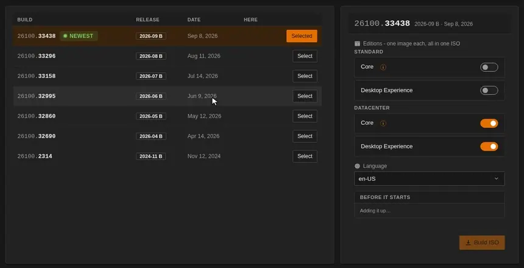</p>

### <picture><source media="(prefers-color-scheme: dark)" srcset=".github/assets/icons/update-dark.png"></picture> Keeping Windows golds current

Switch on **Keep current** on a Windows gold card. When Microsoft ships a newer Patch Tuesday
build of the same product, the studio — in your next maintenance window — builds one new ISO
with the same editions and language, bakes every gold that follows it again with its own
settings, deletes the old ISO and removes golds beyond the number you keep (2 by default, never
one with linked clones or one a design pins). It never leaves the branch: same product, same base
build, no previews unless you allow them, never Insider builds.

<p>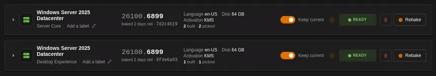</p>

**Media → Windows updates** shows what follows what, the runs and their state, with **Start now**
and **Retry**. Only golds baked from an ISO the studio built can follow — an uploaded ISO does
not know which product it is.

<p>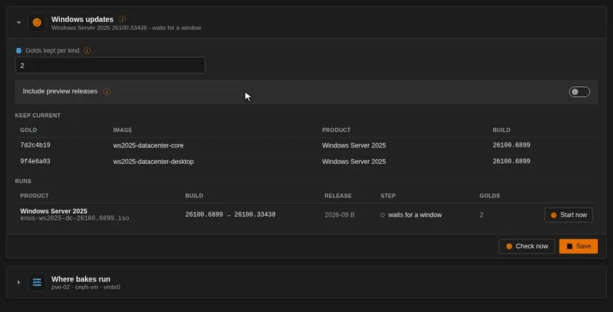</p>

## <picture><source media="(prefers-color-scheme: dark)" srcset=".github/assets/icons/monitor-dark.png"></picture> Design and deploy

The left side of the studio is the design; it saves itself and everyone signed in works on the
same one.

| Blade | What you set there |
|---|---|
| <picture><source media="(prefers-color-scheme: dark)" srcset=".github/assets/icons/settings-dark.png"></picture> **VM settings** | Defaults for every VM: naming, password length, local user names, region |
| <picture><source media="(prefers-color-scheme: dark)" srcset=".github/assets/icons/vnet-dark.png"></picture> **Networks** | The bridges and SDN VNets VMs connect to, with subnet, gateway and DNS for static addresses |
| <picture><source media="(prefers-color-scheme: dark)" srcset=".github/assets/icons/vm-dark.png"></picture> **Virtual machines** | One card per VM: image, size, NICs, static IP or DHCP, data disks, TPM, Windows roles and features, Linux packages, an SSH key |
| <picture><source media="(prefers-color-scheme: dark)" srcset=".github/assets/icons/key-dark.png"></picture> **Windows licenses** | Real product keys, attached to the VMs that should get them (the golds carry KMS client keys) |
| <picture><source media="(prefers-color-scheme: dark)" srcset=".github/assets/icons/identity-dark.png"></picture> **Domain Join** | Accounts that join Windows and Linux VMs to Active Directory at first boot |
| <picture><source media="(prefers-color-scheme: dark)" srcset=".github/assets/icons/arc-dark.png"></picture> **Azure Arc** | Service principals that onboard VMs to Azure Arc at first boot |
| <picture><source media="(prefers-color-scheme: dark)" srcset=".github/assets/icons/deploy-dark.png"></picture> **Deploy** | Preflight checks, then build: everything, a selection, or one VM |
| <picture><source media="(prefers-color-scheme: dark)" srcset=".github/assets/icons/vm-overview-dark.png"></picture> **Connect** | Addresses, consoles, users and passwords of the built VMs |

A deploy clones the gold, sets the hardware, attaches a seed disk with the VM's own settings and
boots it once. Windows runs a short WinPE pass (roles, features, Features on Demand, the answer
file) and then its first boot; Linux runs cloud-init. When the VM powers off, the seed goes and
the VM starts for real.

<p>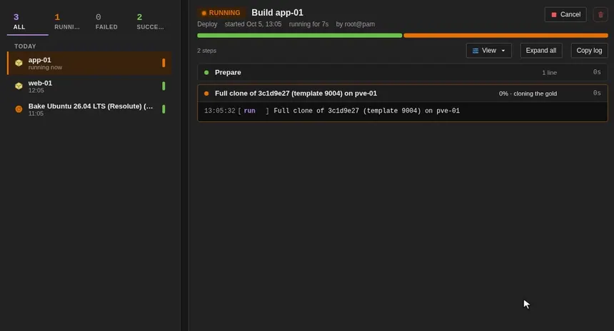</p>

<p>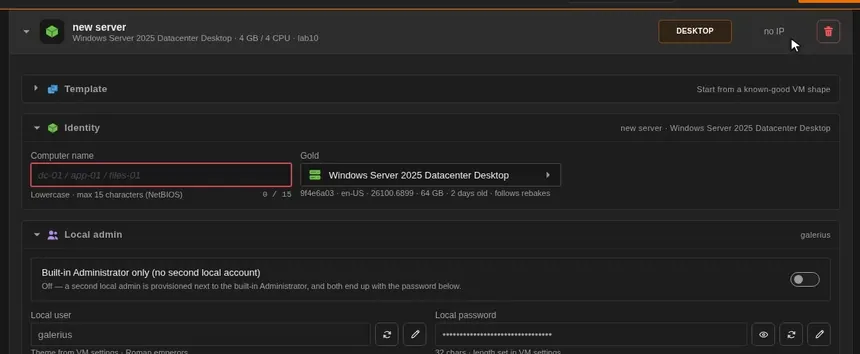</p>

<p>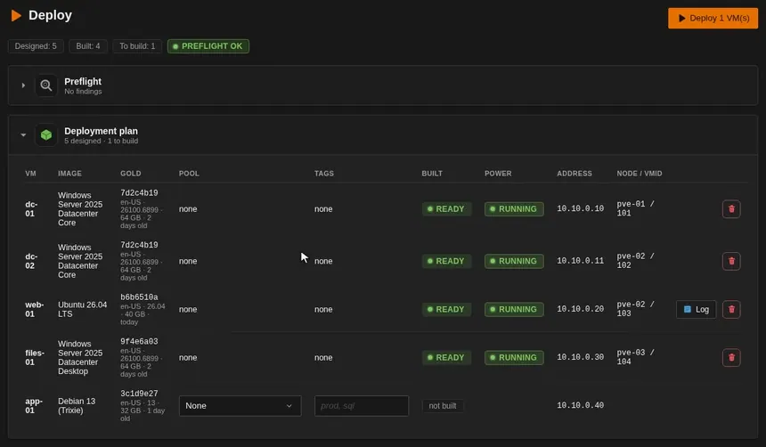</p>

### <picture><source media="(prefers-color-scheme: dark)" srcset=".github/assets/icons/key-dark.png"></picture> Passwords

Every VM gets a generated password (16, 32 or 64 characters, set in VM settings).
**Connect → Passwords and keys** shows them. **Export CSV** downloads `vm-passwords.csv`, one row
per VM:

| VM | OS | Address | User | Password | SSH |
|---|---|---|---|---|---|
| `dc-01` | Windows | `10.10.0.10` | `dc-01\admin` | … | |
| `web-01` | Linux | `10.10.0.20` | `admin` | … | `ssh admin@10.10.0.20` |

The address is the static one, or what the guest agent reported for a VM on DHCP. The passwords
are the design's — if you regenerate one after its VM was built, the VM still has the old one.
The file holds every password in plain text; keep it in a password manager, not on a share.

<p>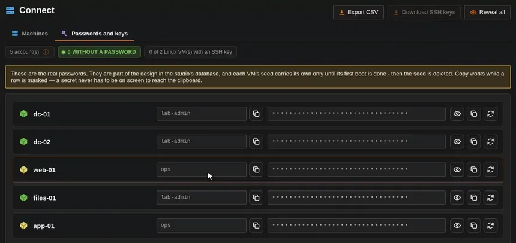</p>

## <picture><source media="(prefers-color-scheme: dark)" srcset=".github/assets/icons/users-dark.png"></picture> Notifications

**Studio settings → Mail**: switch it on, enter your smart host (Proxmox Mail Gateway, an
Exchange relay, a Postfix), port, TLS mode, sender and recipients, and send a test mail. The
studio signs in nowhere — the smart host has to accept mail from the studio's address. **Sent mail**
under the fields lists every mail with what the smart host answered — `250 … queued as …`, or the
refusal and its reason. **Theme** dresses the mails in any of the studio's themes; **Preview** shows a sample
in each.

<p>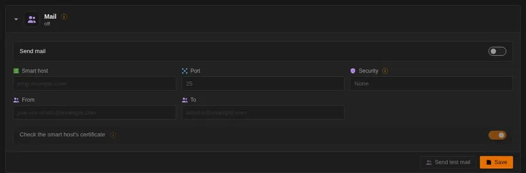</p>

**Studio settings → Notifications** picks which events send a mail. By default: everything that
happens while nobody watches (Windows updates, studio updates, certificate renewals) and every
failure, plus "VM provisioned" and every ISO the studio builds. A built Windows ISO that no gold follows
also gets a mail when Microsoft ships a newer Patch Tuesday build of it.

## <picture><source media="(prefers-color-scheme: dark)" srcset=".github/assets/icons/update-dark.png"></picture> Updating the studio

**Studio settings → Version** compares your build with the newest one on its channel and
installs it with one click — the SHA-256 is checked twice and the old binary stays as
`pve-vm-studio.prev`. Switch on **Install updates automatically** to let it happen in a
maintenance window.

Two channels: **Stable** follows the releases (the default), **Development** every commit on
`main` — untested. While there is no release, Development is the one that updates.

## <picture><source media="(prefers-color-scheme: dark)" srcset=".github/assets/icons/security-dark.png"></picture> CIS hardening (experimental)

> [!CAUTION]
> **Experimental — not thoroughly tested.** The CIS option hardens a Linux gold against the
> CIS Benchmark of its distribution (Level 1 or Level 2 Server). It changes a lot: firewall
> rules that block outgoing traffic, separate volumes for `/var` and `/home`, PAM password
> policy, audit rules, kernel modules switched off, a GRUB password. Software you install later
> may not work under it. The score the studio shows is a **self-assessment by the studio's own
> checks, not a CIS certification** and not CIS-CAT. Do not rely on it for an audit.

Bake a Linux gold with **CIS benchmark → Level 1 / Level 2 Server**. **Policy Catalog** lists
every rule with its level. After the bake, the gold card shows the score and opens a report with
each rule's result and evidence; the GRUB password is kept with it.

<p>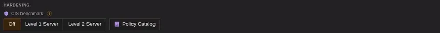</p>

<p>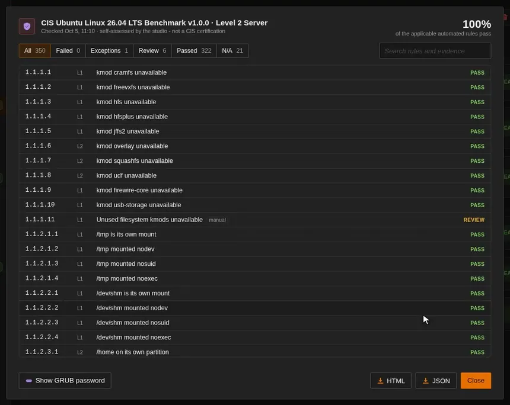</p>

Benchmarks implemented: Ubuntu 26.04 and 24.04, Debian 13 and 12, Rocky Linux, AlmaLinux and
Oracle Linux 10 and 9, openSUSE Leap 16 (SLE 16's). The most thoroughly checked is Ubuntu 26.04
Level 2. Where the studio deviates from a recommendation on purpose, the report says so, with the
reason. With CIS on, package mirrors stay on the distribution's HTTPS defaults, and a VM's
password has to meet the gold's password policy.

The rules and checks are this project's own. The repository contains no text from the CIS
Benchmarks — only recommendation numbers and profile levels to map the rules to them. To read
what a recommendation says, get the benchmark from [CIS](https://www.cisecurity.org/cis-benchmarks)
(free for non-commercial use).

*CIS® and CIS Benchmarks™ are trademarks of the Center for Internet Security, Inc. This project
is not affiliated with, endorsed by or certified by the Center for Internet Security.*

## <picture><source media="(prefers-color-scheme: dark)" srcset=".github/assets/icons/files-dark.png"></picture> Reference

### <picture><source media="(prefers-color-scheme: dark)" srcset=".github/assets/icons/storage-dark.png"></picture> Where things live

| What | Where |
|---|---|
| The studio | `/usr/local/bin/pve-vm-studio` in its container, service `pve-vm-studio` |
| Its data (design, settings, job logs, CIS reports) | `/var/lib/pve-vm-studio` in the container — the database is `studio.db` |
| Bakes and media builds in progress | The container's work volume, emptied when nothing runs |
| Golds | PVE templates in the pool `vm-studio`, tagged `gold` |
| Built ISOs, WinPE, virtio-win | The ISO storage you picked |

Sessions survive a restart; a session nobody used for 8 hours ends.

### <picture><source media="(prefers-color-scheme: dark)" srcset=".github/assets/icons/trash-dark.png"></picture> Uninstall

Remove the VMs and golds you no longer want in PVE first. Then, on a node:

```sh
pct stop <vmid> && pct destroy <vmid>
pveum user delete pve-vm-studio@pve
pveum role delete VmStudioNetwork; pveum role delete VmStudioTagStyle
pvesh delete /pools/vm-studio        # only once it is empty
```

### <picture><source media="(prefers-color-scheme: dark)" srcset=".github/assets/icons/secret-dark.png"></picture> Security

| Secret | Lives in | Do |
|---|---|---|
| VM passwords | The design, in `studio.db`; the VM's seed only until its first boot ends | Rotate them after the lab; delete exported CSVs |
| Domain join and Arc credentials | The design | Use least-privilege accounts |
| The API token | The container's config, readable by the studio only | It is the ceiling of what the studio can do — keep its roles as installed |
| DNS provider credentials (Let's Encrypt) | The container, `0600` | — |

### <picture><source media="(prefers-color-scheme: dark)" srcset=".github/assets/icons/search-dark.png"></picture> Troubleshooting

| Symptom | Fix |
|---|---|
| A bake or deploy fails | Open it under **Jobs** — the log names the step. **Debug** shows everything the guest printed |
| "no storage holds 'import'" | Enable the content type **Import** on a storage of the bake node |
| Linux bake: packages missing | The bake VM could not reach its mirrors — check the bake bridge, DHCP or the bake addresses, and the gateway |
| Windows bake: no WinPE | Build it under **Media → Windows: WinPE** first |
| A VM shows "name in use" | Another VM in PVE has that name — rename the card |
| The page looks wrong after an update | Reload the tab once |

### <picture><source media="(prefers-color-scheme: dark)" srcset=".github/assets/icons/help-dark.png"></picture> Credits and trademarks

The studio builds on a lot of other work — distributions, Microsoft's update servers through the
UUP dump catalog, the virtio-win project, CIS, open-source tools and Rust libraries.
[NOTICE.md](NOTICE.md) lists every source, what it is used for, its license and the trademarks
involved.
